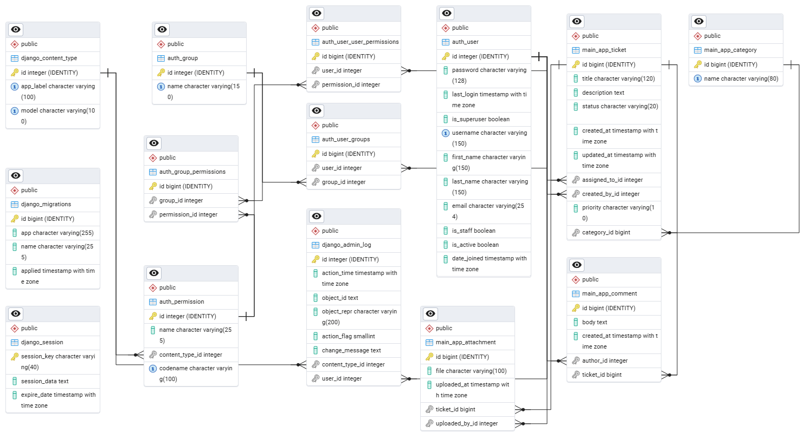

# Django Helpdesk Ticketing System

## Project Overview
A simple helpdesk/ticketing web app built with Django. Users can sign up, log in, create tickets, upload attachments, and add comments. Staff can manage and resolve tickets, and admins can assign tickets to agents directly from the tickets list. The UI is plain, responsive, and uses only custom CSS (no frameworks).

## Tech Stack
- Python 3.13
- Django
- SQLite (dev) or PostgreSQL
- HTML + Django Templates (DTL)
- Vanilla CSS (no frameworks)

## Data Model (ERD)
diagram:



Entity notes:
- User: standard Django auth_user (username, email, is_staff, is_superuser, date_joined)
- Category: id, name
- Ticket: id, title, description, status, priority, created_at, updated_at; FKs → category (Category), created_by (User), assigned_to (User)
- Comment: id, body, created_at; FKs → ticket (Ticket), author (User)
- Attachment: id, file, uploaded_at; FKs → ticket (Ticket), uploaded_by (User)

## Installation & Setup

### 1) Clone and enter the project
```bash
git clone <your-repo-url>
cd <repo-folder>
```

### 2) Create and activate a virtual environment
```bash
python -m venv venv
# Windows
venv\Scripts\activate
# macOS/Linux
source venv/bin/activate
```

### 3) Install dependencies
```bash
pip install -r requirements.txt
```

### 4) Configure settings
- Dev uses SQLite by default.
- For production, set SECRET_KEY, DEBUG=False, ALLOWED_HOSTS, and database credentials via environment variables or your hosting dashboard.

### 5) Run migrations and create a superuser
```bash
python manage.py migrate
python manage.py createsuperuser
```

### 6) Run the server
```bash
python manage.py runserver
```

## Features / User Stories

### Authentication
- As a visitor, I can sign up and log in.
- As a logged-in user, I can log out.

### Tickets
- As a user, I can create a ticket with title, description, priority, and optional category.
- As a user, I can view my tickets and see their status and assignee.
- As a user, I can add comments and upload attachments on a ticket detail page.
- As a user or staff (depending on permissions), I can edit a ticket I created or manage assigned tickets.

### Staff/Admin
- As staff, I can see tickets assigned to me and filter the list by status, priority, category, and search.
- As admin/staff, I can assign or unassign a ticket directly from the tickets list page.
- As admin, I can delete tickets.

### UI/UX
- Simple, consistent pages with custom CSS.
- Responsive layout (filters collapse and tables scroll on small screens).
- Empty-state CTA on the tickets list to quickly create a ticket.

### Main URLs
- `/` login
- `/accounts/signup/` sign up
- `/dashboard/` dashboard
- `/tickets/` list + filters + inline assignment (staff/admin)
- `/tickets/new/` create
- `/tickets/<id>/` detail
- `/tickets/<id>/edit/` update
- `/tickets/<id>/delete/` delete
- `/tickets/<id>/comment/` add comment
- `/tickets/<id>/attach/` upload attachment
- `/admin/` Django admin

## Challenges & Solutions

- Missing Home view causing URL import errors  
  Fixed by adding a Home view using LoginView and matching it in urls.py.

- Inline ticket assignment from the list page  
  Added a POST route `tickets/<id>/assign/` and a simple form in the list template for staff/admins.

- Filters and empty states on the tickets list  
  Implemented GET filters for status, priority, category, and a search field; added an empty-state CTA to create a ticket.

- Static file organization  
  Moved page-specific styles into `main_app/static/css/tickets.css` and linked them in the template so HTML stays clean.

- Role-based visibility  
  Kept logic simple: superuser sees all, staff sees assigned tickets, regular users see tickets they created.

- Security hygiene for publishing  
  Left local dev with SQLite/DEBUG; documented moving secrets and DB creds out of settings.py for production.

## Future Improvements
- Pagination on tickets list
- Basic email notifications on assignment/status change
- Simple status transition buttons (Open → In Progress → Resolved → Closed)
- Minimal tests for models and views
